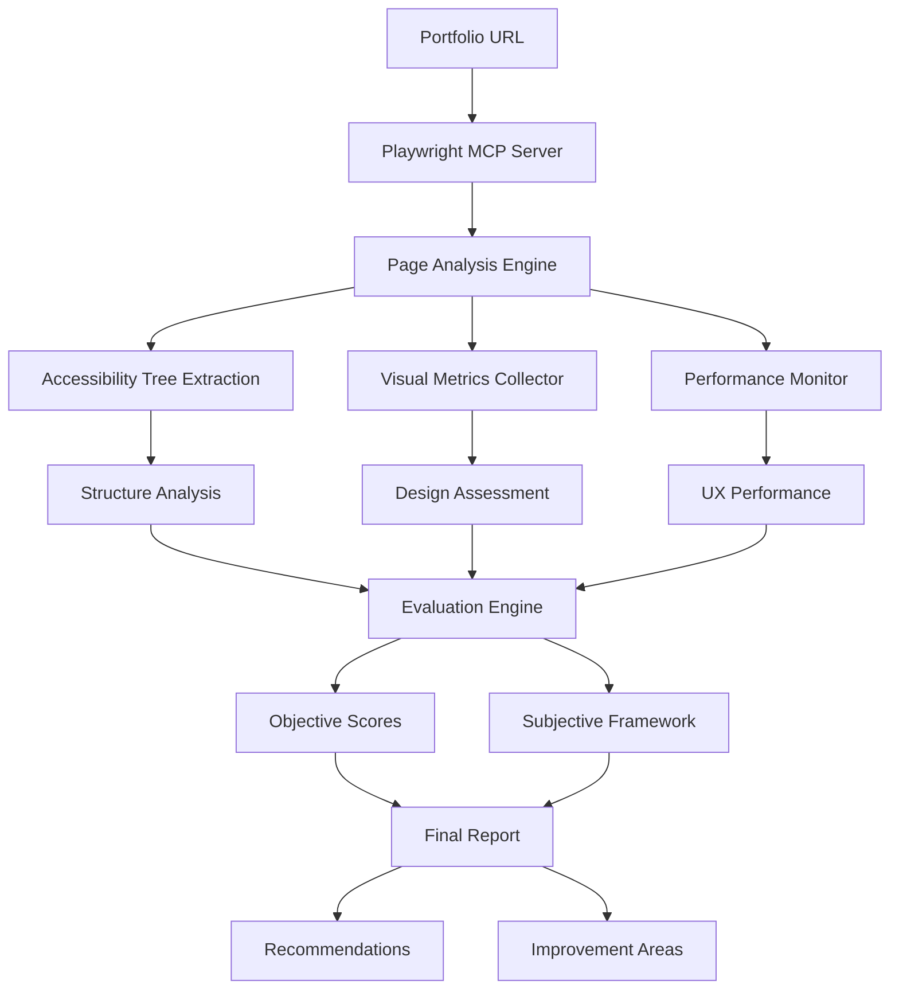

# Design Portfolio Evaluation Framework

## Component Diagram Flow



## Objective Metrics Framework

### 1. Technical Performance (25%)
- **Page Load Time**: < 3 seconds (Google standard)
- **Core Web Vitals**:
  - LCP (Largest Contentful Paint): < 2.5s
  - FID (First Input Delay): < 100ms
  - CLS (Cumulative Layout Shift): < 0.1
- **Mobile Responsiveness**: Viewport adaptation score
- **Accessibility Score**: WCAG compliance (A, AA, AAA)

### 2. Visual Design Metrics (30%)
- **Color Contrast Ratio**: Minimum 4.5:1 for normal text
- **Typography Hierarchy**: H1-H6 proper usage
- **White Space Ratio**: 30-50% of total page area
- **Image Optimization**: Format, size, loading performance
- **Grid Consistency**: Alignment and spacing uniformity

### 3. Content Structure (25%)
- **Navigation Clarity**: Menu depth and accessibility
- **Information Architecture**: Logical content flow
- **Call-to-Action Placement**: Above fold visibility
- **Content Readability**: Flesch reading score

### 4. Interactive Elements (20%)
- **Button States**: Hover, active, disabled styling
- **Form Validation**: Real-time feedback
- **Loading States**: Progressive disclosure
- **Error Handling**: User-friendly messages

## Tackling Subjectiveness in Design Evaluation

### 1. Quantified Subjective Metrics

#### Visual Hierarchy Score (0-100)
```javascript
const visualHierarchyMetrics = {
  fontSizeProgression: {
    weight: 20,
    calculation: (elements) => {
      // Check for proper H1 > H2 > H3 > body text progression
      const sizes = extractFontSizes(elements);
      return calculateProgression(sizes);
    }
  },
  colorWeightDistribution: {
    weight: 20,
    calculation: (palette) => {
      // Analyze primary/secondary/accent color usage
      return analyzeColorWeight(palette);
    }
  },
  spacingConsistency: {
    weight: 20,
    calculation: (layout) => {
      // Check margin/padding consistency
      return measureSpacingPatterns(layout);
    }
  }
};
```

#### Brand Consistency Score (0-100)
- **Color Palette Adherence**: 25 points
- **Typography Consistency**: 25 points
- **Visual Style Coherence**: 25 points
- **Voice and Tone Alignment**: 25 points

### 2. Comparative Analysis Framework
```javascript
const subjectiveFramework = {
  aesthetics: {
    modernity: { 
      scale: '1-10', 
      benchmark: 'industry_standards_2025',
      weightedCriteria: {
        colorTrends: 0.3,
        layoutPatterns: 0.3,
        typographyChoices: 0.2,
        interactionDesign: 0.2
      }
    },
    creativity: { 
      scale: '1-10', 
      benchmark: 'peer_comparison',
      evaluationPoints: [
        'uniqueness_of_approach',
        'innovative_interactions',
        'original_visual_solutions',
        'creative_content_presentation'
      ]
    },
    elegance: { 
      scale: '1-10', 
      benchmark: 'minimalism_principles',
      criteria: [
        'visual_clarity',
        'purposeful_elements',
        'harmonious_composition',
        'refined_execution'
      ]
    }
  },
  usability: {
    intuitiveness: {
      scale: '1-10',
      benchmark: 'user_expectation_patterns',
      testableElements: [
        'navigation_predictability',
        'icon_recognition',
        'interaction_feedback',
        'mental_model_alignment'
      ]
    }
  }
};
```

### 3. Multi-Perspective Evaluation Matrix

| Evaluation Dimension | Industry Expert | Target User | Peer Designer | Technical Lead |
|---------------------|-----------------|-------------|---------------|----------------|
| Visual Appeal       | 30%             | 40%         | 35%           | 10%            |
| Usability          | 25%             | 35%         | 20%           | 30%            |
| Technical Quality   | 20%             | 10%         | 15%           | 40%            |
| Innovation         | 25%             | 15%         | 30%           | 20%            |

## Playwright MCP Implementation Strategy

### Phase 1: Automated Data Collection
```javascript
// Using Playwright MCP for accessibility tree analysis
const portfolioAnalyzer = {
  async collectStructureData(page) {
    // Extract accessibility tree without screenshots
    const accessibilityTree = await page.accessibility.snapshot();
    const semanticStructure = await this.parseSemanticHTML(page);
    const interactiveElements = await this.findInteractiveElements(page);
    
    return {
      structure: accessibilityTree,
      semantics: semanticStructure,
      interactions: interactiveElements
    };
  },
  
  async measurePerformance(page) {
    // Core Web Vitals measurement
    const metrics = await page.evaluate(() => {
      return new Promise((resolve) => {
        new PerformanceObserver((list) => {
          const entries = list.getEntries();
          resolve(entries);
        }).observe({ entryTypes: ['navigation', 'paint', 'largest-contentful-paint'] });
      });
    });
    
    return this.calculateWebVitals(metrics);
  }
};
```

### Phase 2: Objective Analysis Engine
```javascript
class ObjectiveMetricsCalculator {
  async evaluateAccessibility(page) {
    // Inject axe-core for accessibility testing
    await page.addScriptTag({ path: 'node_modules/axe-core/axe.min.js' });
    
    const results = await page.evaluate(() => {
      return axe.run();
    });
    
    return this.calculateAccessibilityScore(results);
  }
  
  async analyzeVisualDesign(page) {
    const colorPalette = await this.extractColorPalette(page);
    const typography = await this.analyzeTypography(page);
    const layout = await this.measureLayout(page);
    
    return {
      colorHarmony: this.scoreColorHarmony(colorPalette),
      typographyScore: this.scoreTypography(typography),
      layoutScore: this.scoreLayout(layout)
    };
  }
}
```

### Phase 3: Subjective Framework Application
```javascript
class SubjectiveEvaluator {
  constructor() {
    this.benchmarkDatabase = new BenchmarkDatabase();
    this.aestheticsEngine = new AestheticsAnalyzer();
  }
  
  async evaluateAesthetics(pageData) {
    const modernityScore = await this.assessModernity(pageData);
    const creativityScore = await this.assessCreativity(pageData);
    const eleganceScore = await this.assessElegance(pageData);
    
    return {
      modernity: modernityScore,
      creativity: creativityScore,
      elegance: eleganceScore,
      overall: this.calculateWeightedAverage([
        { score: modernityScore, weight: 0.4 },
        { score: creativityScore, weight: 0.3 },
        { score: eleganceScore, weight: 0.3 }
      ])
    };
  }
  
  async generateRecommendations(scores, pageData) {
    const improvements = [];
    
    if (scores.accessibility < 80) {
      improvements.push({
        category: 'Accessibility',
        priority: 'High',
        suggestion: 'Improve color contrast ratios and add alt text',
        implementation: 'Use contrast checker tools and audit images'
      });
    }
    
    return improvements;
  }
}
```

## Expected Outcomes

### Quantitative Results
- **Performance Score**: 0-100 (weighted average of Core Web Vitals)
- **Accessibility Compliance**: A/AA/AAA rating with specific violation counts
- **Design Consistency**: 0-100 (color, typography, spacing uniformity)
- **Technical Quality**: 0-100 (code quality, semantic HTML, responsive design)

### Qualitative Insights
- **User Experience Gaps**: Specific UX issues with user impact assessment
- **Design Trend Alignment**: Current vs. emerging design patterns analysis
- **Brand Consistency Evaluation**: Visual identity coherence across pages
- **Competitive Positioning**: Benchmarking against industry leaders

### Actionable Recommendations
```javascript
const recommendationTemplate = {
  priority: 'High|Medium|Low',
  category: 'Performance|Accessibility|Design|Content',
  issue: 'Specific problem identified',
  impact: 'User/business impact description',
  solution: 'Step-by-step fix instructions',
  resources: ['Links to tools', 'Reference materials'],
  estimatedEffort: 'Hours/days to implement',
  expectedImprovement: 'Projected score increase'
};
```

This framework transforms subjective design evaluation into a systematic, measurable process while maintaining the nuanced understanding that makes great design evaluation valuable.